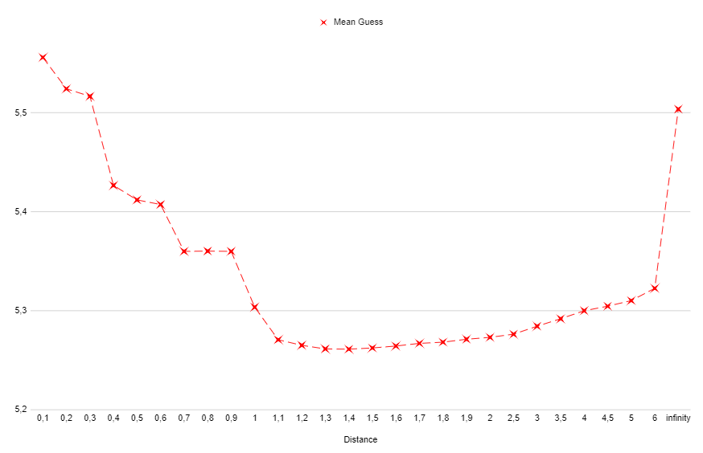
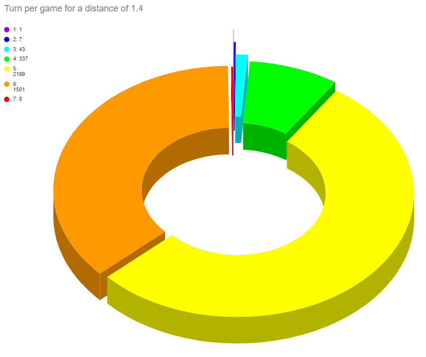
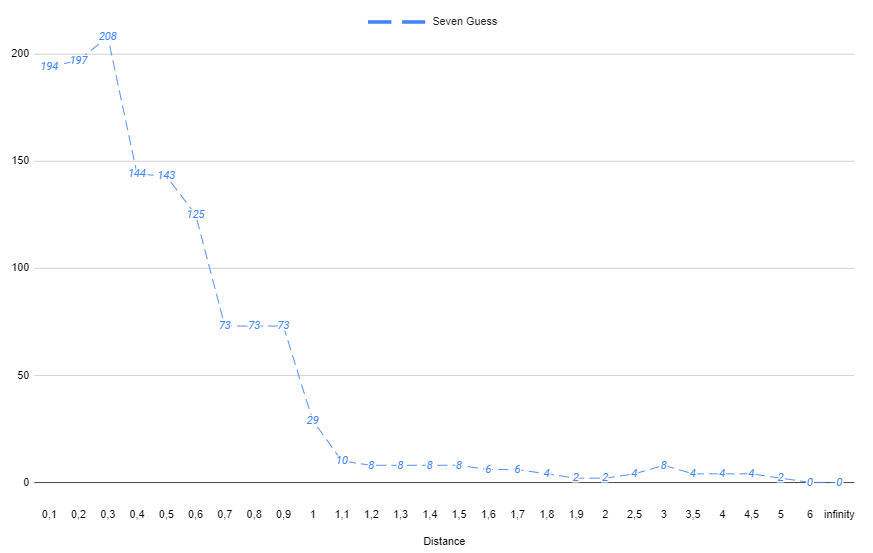

# Solver MasterMind

[MasterMind](https://en.wikipedia.org/wiki/Mastermind_(board_game)) is a code-breaking game. The objective of this project is to find the best strategy to this game.

## Rules

The objective is to find a secret code in the lest amount of guess. The code is a combination of 4 colors choose from 8 possibilities. This mean there is 8^4 = 4096 possibles code.
For every guess, the player is informed of how many correct colors are in the correct position (simbolised with red or black indicators) and how many correct colors are in the wrong position (simbolised with white indicators). There is 2^4-1-1 = 14 possibles feedback.

## Strategy

The best guess at every point in the game is the one that give the most information. This mean that the best guess minimize the number of possible code remaining. For a given guess and a list of possible code, we can compute the probability of every feedback and the number of possible code that will remain. We just need to find a way to compile those result in a unique number to score each guess. (I now know that I may should have used the formulat of [Entropy](https://en.wikipedia.org/wiki/Entropy_(information_theory)) but I didn't do it at the time.) I choose to sum for every feedback the number of remaining possible code raise to a given power and ponderate by the probability of getting this feedback. The given power is a parameter that we can adjust to find the strategy that fit our need. I call it the distance parrameter in reference to the [Minkowski distance](https://en.wikipedia.org/wiki/Minkowski_distance).

## Results

By running every possible game using our strategy we get the mean number of guess to find the correct code. The distance parrameter that minimize the mean number of guess is around 1.4.

But using a distance of 1.4 leads to 8 games needing 7 guess.

We can find a strategy that garenty less than 7 guess with a distance around 6.0 but at the cost of wost performance overall.

## Conclusion

There is a treadof between performence overall and performance warenty.
